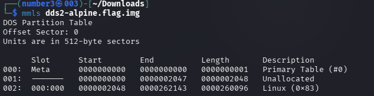
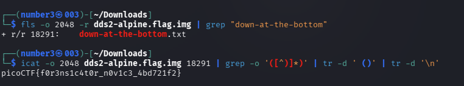
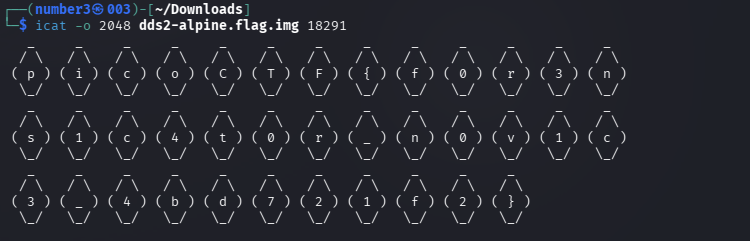

# [Disk, disk, sleuth! II] - PicoCTF [2021]

**Category:** Forensics 
**Difficulty:** Medium 

--- 

## Description 

All we know is the file with the flag is named down-at-the-bottom.txt... 

dds2-alpine.flag.img.gz 

--- 

## Analysis 

Just unzip the file with `gunzip` to get the `dds2-alpine.flag.img` and display the partition layout by using the command `mmls`: 
```bash
mmls dds2-alpine.flag.img
```


So our purpose is to read the content of `down-at-the-bottom.txt`. We have to find the **inode** of that file — it resides inside the Linux partition.

---

## Solutions 

Use `fls` (File Listing) combined with `grep` to find the file.
```bash
fls -o 2048 -r dds2-alpine.flag.img | grep -i "down-at-the-bottom.txt"
```


And next the command `icat` will help me read the content in that file but why I combine it with `grep` and `tr -d`. Because the content is more complicated than just a normal flag. 


The command `grep` help me filter the unnecessary characters and also `tr -d` helps me erase the endline and the space. 

---

## Flag!

picoCTF{f0r3ns1c4t0r_n0v1c3_4bd721f2}

---

## Takeaways

- **`fls`** (File Listing) is a Sleuth Kit tool that lists files and directories inside a disk image — similar to `ls` on a live system, but reads filesystem metadata directly without mounting. The `-o` flag specifies the **sector offset** of the partition (obtained from `mmls`), and `-r` enables recursive listing. Output format: `r/r <inode>  <filename>` for regular files, `d/d` for directories.
  ```bash
  fls -o 2048 -r dds2-alpine.flag.img | grep "down-at-the-bottom.txt"
  ```

- **Inode** — In Unix-like filesystems, every file is represented by an **inode** (index node): a data structure storing the file's metadata (size, permissions, timestamps, pointers to data blocks) but **not** its filename. The filename only exists in the directory entry, which maps a name → inode number. Forensic tools like `fls` and `icat` use inode numbers to directly access file content — this works even if the file is deleted, because the inode may still hold the data until it's overwritten.

- **`icat`** (Inode Concatenate) extracts and prints the content of a file from a disk image using its **inode number**, bypassing the directory structure entirely.
  ```bash
  icat -o 2048 dds2-alpine.flag.img <inode_number>
  ```

- **`tr -d`** — The `tr` (translate) command is used to delete or replace characters from a stream. The `-d` flag means **delete**: it removes every occurrence of the specified characters. In this challenge, it strips newlines and spaces that would otherwise break the flag format.
  ```bash
  icat ... | tr -d '\n'   # remove newlines
  icat ... | tr -d ' '    # remove spaces
  ```

- **`grep '([^)]*)'`** — A **regex pattern** used to extract text enclosed in parentheses:
  | Symbol | Meaning |
  |--------|---------|
  | `(` | Match a literal `(` |
  | `[^)]` | Match any character that is **not** `)` |
  | `*` | Zero or more of the preceding character class |
  | `)` | Match a literal `)` |

  Together, `([^)]*)` captures everything between `(` and `)` without greedily jumping to a later `)`. This is safer than `(.*)` which could over-match across multiple closing delimiters on the same line.
