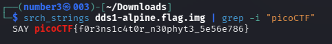

# [Disk, disk, sleuth!] - PicoCTF [2021]

**Category:** Forensics 
**Difficulty:** Medium 

--- 

## Description 

Use srch_strings from the sleuthkit and some terminal-fu to find a flag in this disk image 

dds1-alpine.flag.img.gz

--- 

## Analysis 

Inside the archive is raw disk image file (disk.img), so I extracted it using `gunzip`.
``` bash
gunzip -c dds1-alpine.flag.img.gz > dds1-alpine.flag.img
```

`srch_strings` (part of the Sleuth Kit) is an upgraded version of `strings`, professionally designed for Digital Forensics and works with disk images such as `.img`, `.raw`, `.dd`.

---

## Solutions 

I quickly realized I can combine it with `grep` just like `strings`. Use the command:
```bash
srch_strings -a dds1-alpine.flag.img | grep -i "picoCTF" 
```


---

## Flag!

picoCTF{f0r3ns1c4t0r_n30phyt3_5e56e786}

---

## Takeaways

- **`srch_strings`** is a tool from **The Sleuth Kit (TSK)** that works like `strings` but is optimized for disk images — it can traverse partition and filesystem structures to extract printable strings more accurately. Combine it with `grep` to filter results quickly.
