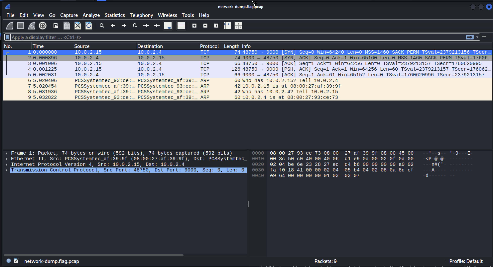
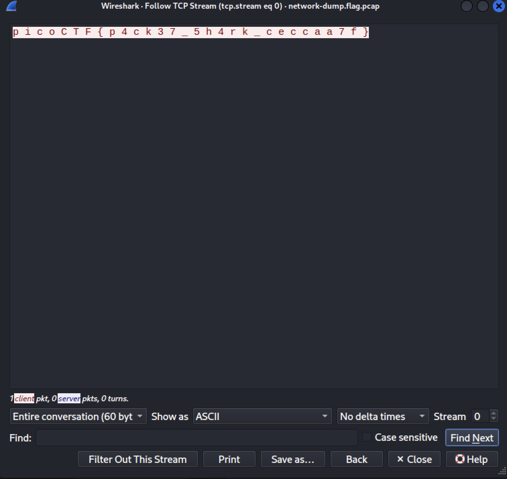

# [Packets Primer] - PicoCTF [2022]

**Category:** Forensics  
**Difficulty:** Medium  

---

## Description

Download the packet capture file and use packet analysis software to find the flag.

Attachments: `network-dump.flag.pcap`

---

## Analysis

This is a `.pcap` (Packet Capture) file — a format used to record and analyze network traffic over a period of time.

To read the contents of the pcap file from the terminal, we use **TShark** (the command-line version of Wireshark):

Launch Wireshark directly from the terminal by passing the file as an argument:

```bash
wireshark network-dump.flag.pcap
```

This opens the Wireshark GUI with the capture file already loaded. Look through the list of captured packets.



At **packet #4**, we notice it is a TCP packet carrying **60 bytes of data** — unlike the surrounding handshake packets. This makes it suspicious as a potential flag carrier.

**Right-click** on packet #4 → select **Follow** → choose **TCP Stream**. This opens a new window showing the full stream content in readable text, where we can see a string starting with `p i c o` — confirming the flag is hidden inside this packet.



---

## Solutions

Use the `strings` command to extract all human-readable strings from the pcap file, pipe it through `grep` to filter for the flag prefix, and use `tr -d ' '` to strip any extra whitespace:

```bash
strings network-dump.flag.pcap | grep -i "p i c o" | tr -d ' '
```


---

## Flag

picoCTF{p4ck3t_5h4rk_b7e0440c}

---

## Takeaways

- A `.pcap` (Packet Capture) file stores recorded network traffic and can be opened with tools like **Wireshark** or **TShark** for analysis.
- **Wireshark** is a powerful network analysis tool that can be launched directly from the terminal with `wireshark <file.pcap>`.
- Not every packet is relevant — pay attention to **payload size** to spot packets that carry actual data.
- The **Follow → TCP Stream** feature in Wireshark reassembles the full conversation between two endpoints, making it easy to read hidden text data inside packets.