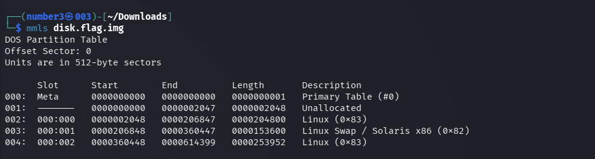
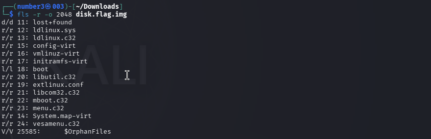

# [Sleuthkit Apprentice] - PicoCTF [2022]

**Category:** Forensics 
**Difficulty:** Medium 

--- 

## Description 

Download this disk image and find the flag.

disk.flag.img.gz

--- 

## Analysis 

Just unzip the file with `gunzip` to get the `disk.flag.img` and display the partition layout by using the command `mmls`: 
```bash
mmls disk.flag.img
```
So the matter worth noting in this partition layout is conclude two partitions of Linux.



---

## Solutions 

Use `fls` (File Listing) combined with `grep` to find some files or may be the flag. I search for the first partition from the sector 2048 but nothing. 
```bash
fls -o 2048 -r disk.flag.img | grep -i "picoCTF"
=> nothing 

fls -o 2048 -r disk.flag.img | grep -i "flag"
=> nothing
```


I searched for `flag` in that first partition but found nothing relevant, so I moved on to the second partition. I use the same way for the second partition start at 360448 sector. And there are two attentioned files txt. 


Next command `icat` help me to read the text of two files. The flag came out. 
```bash
icat -o 360448 disk.flag.img 2082

icat -o 360448 disk.flag.img 2371
```


---

## Flag!

picoCTF{by23_5urf3r_adac6cb4}

---

## Takeaways

- **Always check all partitions** — A disk image can contain multiple partitions. In this challenge, the Linux filesystem was split across two separate partitions (starting at sector `2048` and `360448`). Searching only the first partition returned nothing; the flag was hidden in the second one. Always run `mmls` first to map out the full partition layout, then systematically scan **every** Linux partition with `fls` before giving up.
