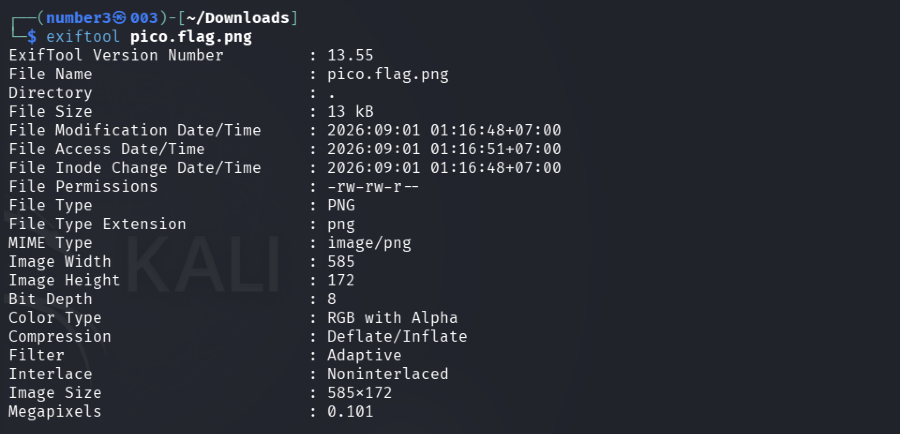
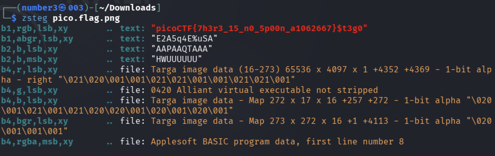

# [St3g0] - PicoCTF [2022]

**Category:** Forensics  
**Difficulty:** Medium  

---

## Description

Download this image file and find the flag.

Attachments: pico.flag.png

---

## Analysis

The attachment is a PNG file. I started by checking its metadata with `exiftool` to look for anything suspicious embedded in the file headers:

```bash
exiftool pico.flag.png
```


The metadata came back clean — nothing hidden in the EXIF fields. I then tried to extract readable strings and filter for the flag:

```bash
strings pico.flag.png | grep -i "picoCTF"
```

That returned nothing either. Opening the image visually showed a completely normal-looking picture with no obvious anomalies.

Since both surface-level approaches failed, the flag must be hidden deeper inside the image data itself.

---

## Solutions

With clean metadata and no readable strings, the most likely hiding technique is **LSB (Least Significant Bit) steganography** — data embedded directly into the pixel values of the image. I used `zsteg` to scan for hidden data:

```bash
zsteg pico.flag.png 
```


`zsteg` automatically detected and extracted the flag hidden in the LSB channel of the image.

---

## Flag!

picoCTF{7h3r3_15_n0_5p00n_a8ae3b0c}

---

## Takeaways

- **Steganography** is the technique of hiding secret information *within* an ordinary, non-secret file (image, audio, video) so that the existence of the hidden data is not obvious. Unlike encryption (which makes data unreadable), steganography makes data invisible by blending it into a carrier file.

- **LSB Steganography** (Least Significant Bit) — Each pixel in a PNG image is made up of color channels (R, G, B), and each channel is stored as an 8-bit value (0–255). The **least significant bit** is the rightmost bit — flipping it changes the color value by only ±1, a difference completely invisible to the human eye. By replacing these LSBs across thousands of pixels, an attacker can encode a secret message without visibly altering the image.

  Example: storing 1 bit per channel across an RGB image:
  ```
  Original pixel: R=11001010  G=00110110  B=10101101
  With hidden bit: R=1100101[1] G=0011011[0] B=1010110[1]  → encodes binary "101"
  ```

- **`zsteg`** is a Ruby-based tool specifically designed to detect and extract data hidden in PNG and BMP images using various steganography techniques, including LSB encoding across different bit planes and color channels. It automatically tries multiple combinations and reports any findings.
  ```bash
  zsteg pico.flag.png          # scan all channels
  zsteg -a pico.flag.png       # try all known methods
  ```
