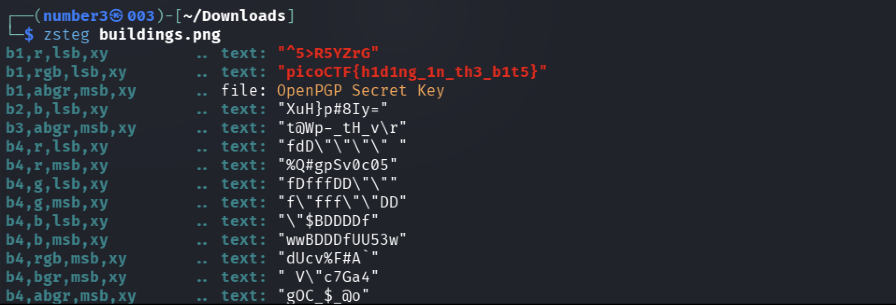

# [What Lies Within] - PicoCTF [2019]

**Category:** Forensics  
**Difficulty:** Medium  

---

## Description

There's something in the building. Can you retrieve the flag?

Attachments: buildings.png

---

## Analysis

The attachment is a PNG file. The image opens normally and looks like a plain photo of a building — nothing suspicious visually. Since the challenge title hints at something hidden inside the image, this is a classic steganography scenario.

---

## Solutions

Applied `zsteg` to scan the image for data hidden in the LSB channels:

```bash
zsteg buildings.png
```


The flag was found immediately in the output.

---

## Flag!

picoCTF{h1d1ng_1n_th3_b1t5}

---

## Takeaways

- No new techniques here — this is the same **LSB steganography** approach as in [St3g0](../St3g0/README.md). When an image looks completely normal and other methods (strings, exiftool) find nothing, `zsteg` is the go-to tool.
- A useful pattern to remember: **normal-looking image + CTF forensics = always try `zsteg` early**.
