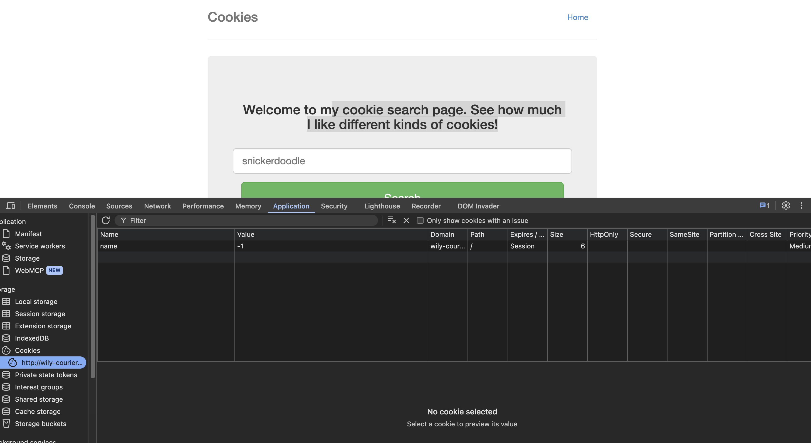
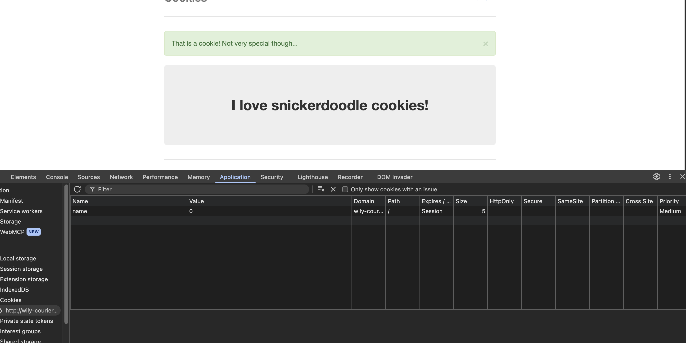
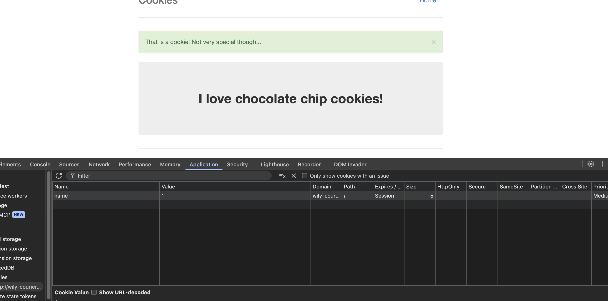
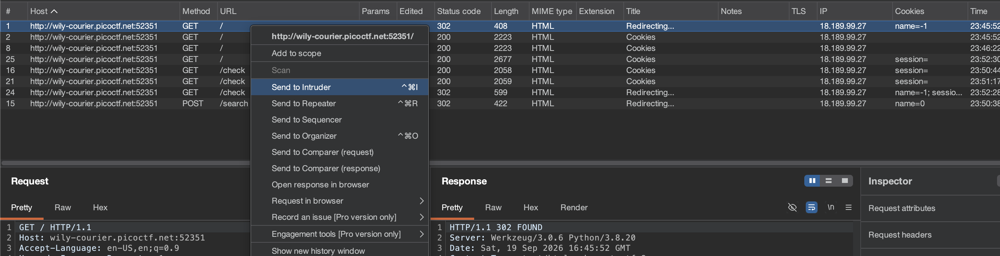
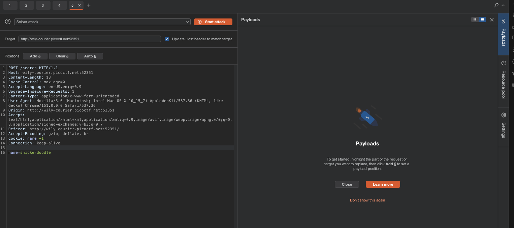
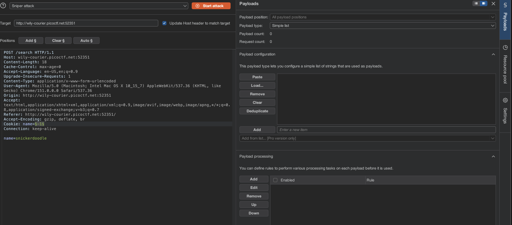
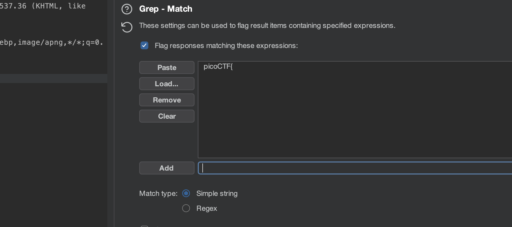
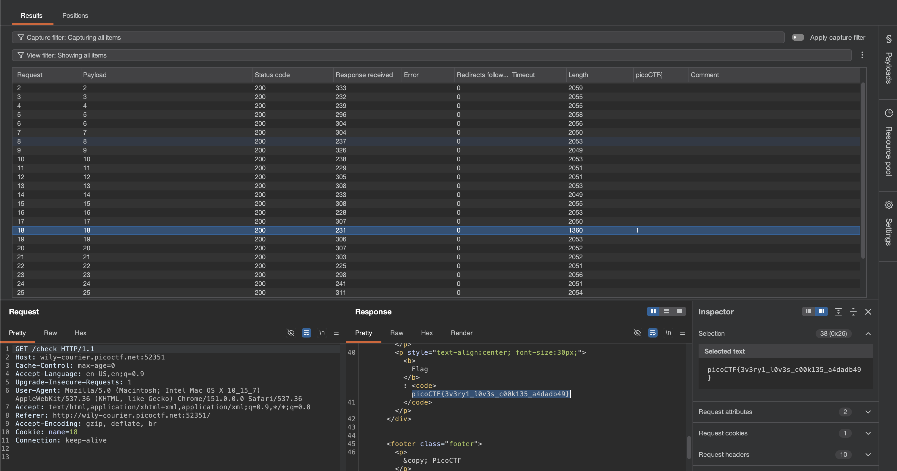

# [Cookies] - PicoCTF [2021]

**Category:** Web Exploitation  
**Difficulty:** Easy

---

## Description

Who doesn't love cookies? Try to figure out the best one.

`http://wily-courier.picoctf.net:52351/`

---

## Analysis

Upon visiting the challenge URL, we are greeted with a simple web page about cookies and a search bar that prompts us to enter a cookie name. The challenge title and the page content both heavily hint that **cookies** — specifically HTTP cookies — are the attack surface here.

Opening the browser's **DevTools** (F12) and navigating to **Application → Cookies**, we can see a cookie named `name` with a value of **`-1`**.


This value is a classic **Sentinel Value** — a special placeholder value (in this case `-1`) deliberately set by the developer to represent a "not selected" or "uninitialized" state. Sentinel values like `-1`, `0`, or `null` are commonly used as flags to indicate that no meaningful selection has been made yet.

Following the page's suggestion, we type a cookie name `snickerdoodle` into the search bar. The page transitions to display a cookie image and — crucially — the cookie value in DevTools changes from `-1` to **`0`**. This reveals the underlying data structure: the backend is very likely using **auto-incrementing integer IDs** to look up and serve different objects (cookies).


To confirm this hypothesis, we manually edit the cookie value from `0` to **`1`** in DevTools and reload the page. The page changes again — a different cookie is displayed. This confirms:


> The cookie value acts as a **direct object reference** — the server fetches and renders different content based purely on the integer ID stored in the cookie, without any authorization check.

Since the flag must be associated with one of these integer IDs, the remaining task is to enumerate through the possible values (0 → 30) and find the response that contains the flag string `picoCTF{`.

---

## Solution

### Tools Required
- **Burp Suite** (Community Edition is sufficient)
- A web browser configured to route traffic through Burp Suite's proxy

### Step-by-Step

**Step 1 — Intercept the Request with Burp Suite Proxy**

Configure your browser to use Burp Suite as an HTTP proxy (default: `127.0.0.1:8080`) and enable **Intercept** in the **Proxy** tab. Navigate to the challenge URL so Burp Suite captures the request. You will notice that the request carries a `Cookie: name=-1` header.

**Step 2 — Send the Request to Burp Suite Intruder**

With the request intercepted, right-click in the request panel and select **"Send to Intruder"**.


> **What is Intruder?**  
> **Burp Suite Intruder** is an automated attack module that allows you to fuzz or iterate through a list of payloads against a specific part of an HTTP request. It is ideal for brute-forcing parameters, IDs, or cookie values to discover hidden content or bypass access controls.

Switch to the **Intruder** tab in Burp Suite.


**Step 3 — Configure the Attack Position**

In the **Positions** sub-tab, Burp Suite will have auto-detected injectable positions (highlighted in `§ §` markers). Clear all existing positions by clicking **"Clear §"**, then manually select the numeric value of the `name` cookie and click **"Add §"**. The request should look like:

```
Cookie: name=§-1§
```


This tells Intruder to replace only the cookie value with our payloads.

**Step 4 — Configure the Payload List**

Switch to the **Payloads** sub-tab. Under **Payload type**, choose **"Numbers"** and configure:
- **From:** `1`
- **To:** `30`
- **Step:** `1`

This will iterate the cookie value from 1 to 30, sending one request per value.

**Step 5 — Configure Grep Match to Find the Flag**

Before launching the attack, go to **Settings** (in Intruder's toolbar) and find the **"Grep - Match"** section. Click **"Add"** and enter:

```
picoCTF{
```



This tells Intruder to scan every response body and flag any response that contains the string `picoCTF` — marking it with a checkmark in the results table, making the flag-containing response instantly identifiable without manually reviewing 30 responses.

**Step 6 — Launch the Attack**

Click **"Start Attack"**. Intruder will send 30 requests, each with a different cookie value. Watch the results table: the column **"picoCTF"** (automatically added by Grep Match) will show a checkmark on the row whose response contains the flag.

Open that response's **Response** tab and locate the flag string embedded in the page content.



---

## Flag

```
picoCTF{3v3ry1_l0v3s_c00k135_a4dadb49}
```

---

## Takeaways

- **Burp Suite Intruder** is a powerful automated fuzzing tool that lets you iterate through payloads against any part of an HTTP request — perfect for enumerating IDs, tokens, or parameter values. The **Grep - Match** feature makes it trivial to surface responses containing specific strings (like a flag prefix) without manual review.

- **Sentinel Values** are special placeholder values (commonly `-1`, `0`, or `null`) used by developers to signal an uninitialized or "empty" state. Spotting a sentinel value like `-1` in a cookie is a strong indicator that the application uses integer IDs to control state, making it a prime target for enumeration.

- **Cookie Manipulation** is an attack vector where an attacker modifies the values stored in browser cookies to alter application behavior. Since cookies are client-controlled, any sensitive logic that relies solely on cookie values — without server-side validation — can be trivially abused.

- **Insecure Direct Object Reference (IDOR)** is a vulnerability that occurs when an application exposes internal object references (such as database IDs) directly to the client and fails to verify whether the requester is authorized to access the referenced object. In this challenge, the integer cookie value maps directly to a backend record with no authorization check — a textbook IDOR vulnerability.
