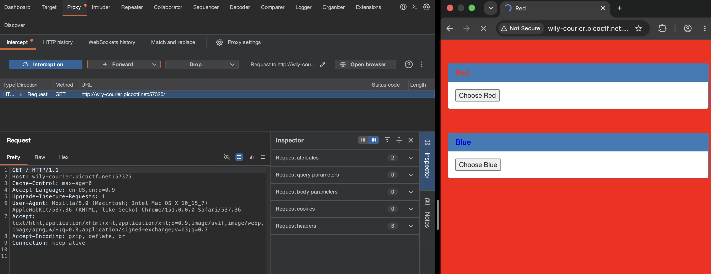
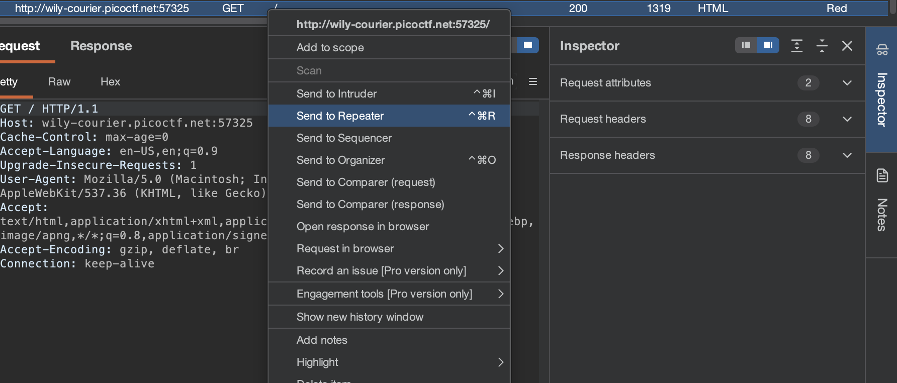
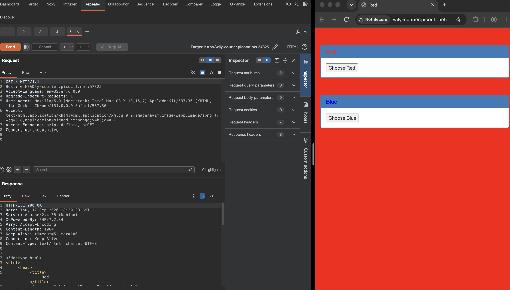
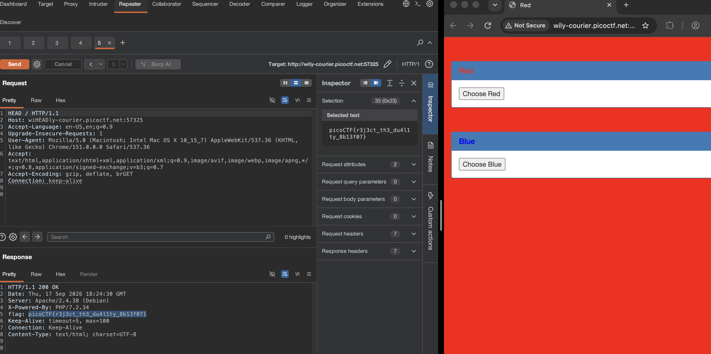

# [GET aHEAD] - PicoCTF [2021]

**Category:** Web Exploitation  
**Difficulty:** Easy

---

## Description

Find the flag being held on this server to get ahead of the competition.

`http://wily-courier.picoctf.net:57325/`

---

## Analysis

When visiting the challenge URL, we are presented with a simple web page that has two buttons: **"Choose Red"** and **"Choose Blue"**. Clicking each button sends a form submission to the server.

The challenge name **"GET aHEAD"** is a strong hint — it references HTTP request methods:
- **GET** — used to *retrieve* a resource
- **HEAD** — used to retrieve only the *headers* of a response (no body)
- **POST** — used to *submit* data to the server

The key insight here is the `HEAD` method. The HTTP `HEAD` request is identical to `GET`, but the server only returns the **response headers** — not the response body. This makes it useful for inspecting metadata that might be hidden from normal page views.

---

## Solution

### Tools Required
- **Burp Suite** (Community Edition is sufficient)
- A web browser configured to route traffic through Burp Suite's proxy

### Step-by-Step

**Step 1 — Set up Burp Suite Proxy**

Configure your browser to use Burp Suite as an HTTP proxy (default: `127.0.0.1:8080`). Enable **Intercept** in the Proxy tab so all outgoing requests are captured before being forwarded to the server.

**Step 2 — Intercept a Request**

Navigate to the challenge URL in the browser. Burp Suite will intercept the initial `GET` request. You can observe the full raw HTTP request in the **Proxy > Intercept** tab.



**Step 3 — Send the Request to Burp Suite Repeater**

With the request intercepted in the **Proxy > Intercept** tab, right-click anywhere in the request panel and select **"Send to Repeater"** (or press `Ctrl+R`).

> **What is Repeater?**  
> **Burp Suite Repeater** is a module that lets you manually modify and re-send HTTP requests as many times as you want — without having to trigger the action in the browser again. It is ideal for testing different request methods, parameters, or headers and observing how the server responds each time.

Switch to the **Repeater** tab in Burp Suite. You will see the full raw HTTP request ready to be edited.





**Step 4 — Change the Method to `HEAD` and Send**

In the Repeater request panel, change the request method from:
```
GET / HTTP/1.1
```
to:
```
HEAD / HTTP/1.1
```

You can do this by:
- Right-clicking in the request panel → **"Change request method"**, or
- Manually editing the first line of the request

Once changed, click the **"Send"** button. Burp Suite will fire the `HEAD` request to the server and display the server's response in the right-hand panel.

**Step 5 — Read the Flag from the Response Headers**

Since `HEAD` only returns response headers (no body), look through the **response headers** in the right panel. The flag is embedded directly inside the headers:



> **Why does this work?**  
> The server was configured to include the flag in the HTTP response headers, which are normally invisible when viewing the page in a browser. The `HEAD` method specifically requests *only* the headers, making this hidden data visible. Repeater made it easy to test this method without re-triggering the browser flow.

---

## Flag

```
picoCTF{r3j3ct_th3_du4l1ty_8b13f07}
```

*(Replace with the actual flag value retrieved from the response headers)*

---

## Takeaways

- **HTTP Methods matter** — `GET`, `POST`, and `HEAD` are distinct verbs with different behaviors. `HEAD` is often overlooked but can reveal metadata not shown in the browser.
- **Burp Suite Proxy** is an essential tool for web security testing. It allows you to **intercept, inspect, and modify** HTTP traffic in real time before it reaches the server.
- **Burp Suite Repeater** is a powerful tool for manually crafting and re-sending HTTP requests. It lets you freely change methods, headers, and body content and observe server responses without browser interference.
- **Response headers** can contain sensitive information (flags, tokens, server details) that is invisible in a standard browser view.
- Always pay attention to challenge titles — "GET aHEAD" directly hints at using the `HEAD` HTTP method.
