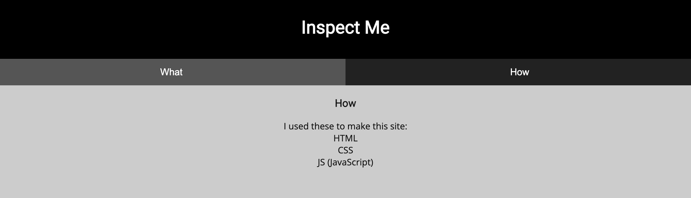
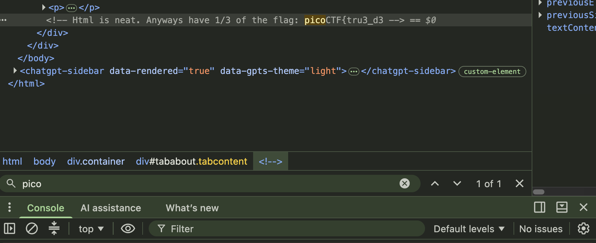
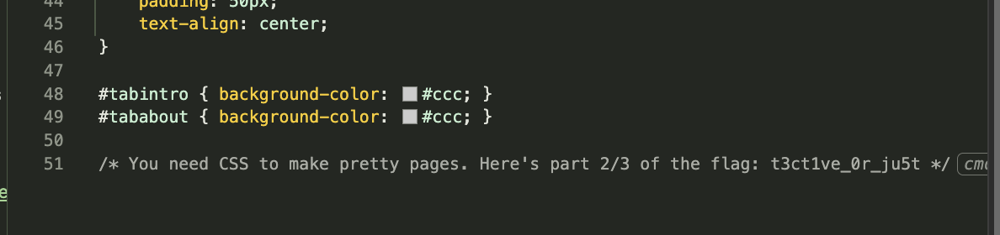
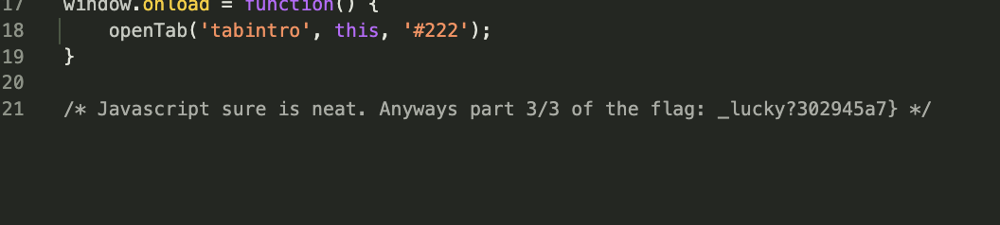

# [Insp3ct0r] - PicoCTF [2019]

**Category:** Web Exploitation
**Difficulty:** Easy

---

## Description

Kishor Balan tipped us off that the following code may need inspection:

Launch Instance

---

## Analysis

The challenge presents a simple webpage built with HTML, CSS, and JavaScript. The flag is split into three parts, each hidden as a comment inside one of these files. Since all client-side files are delivered directly to the browser, any data embedded in them is accessible to anyone — this is a classic Information Disclosure vulnerability.

---

## Solutions

Because I know the flag is split into three parts: 
- I use `Cmd + F` to find in the HTML, the first part of the flag is `picoCTF` so I search for that and here is the result:

***HTML:***

- Next, I move to Sources where css and js files are located, easily find it:

***CSS:***

***JS (Javascript):***

---

## Flag

picoCTF{tru3_d3t3ct1ve_0r_ju5t_lucky?302945a7}

---

## Takeaways

- Client-side files (HTML, CSS, JS) are fully visible to anyone in the browser — never hide sensitive data in comments
- Always check page source and DevTools when approaching a web challenge
- Information Disclosure is one of the most common web vulnerabilities in real-world applications