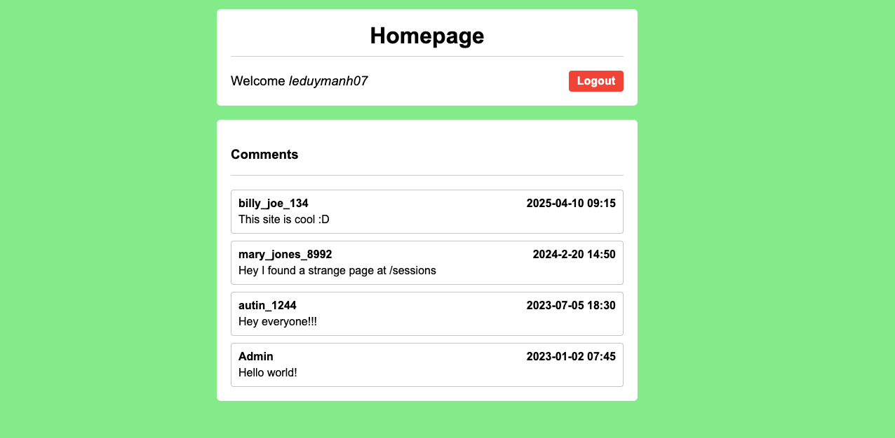
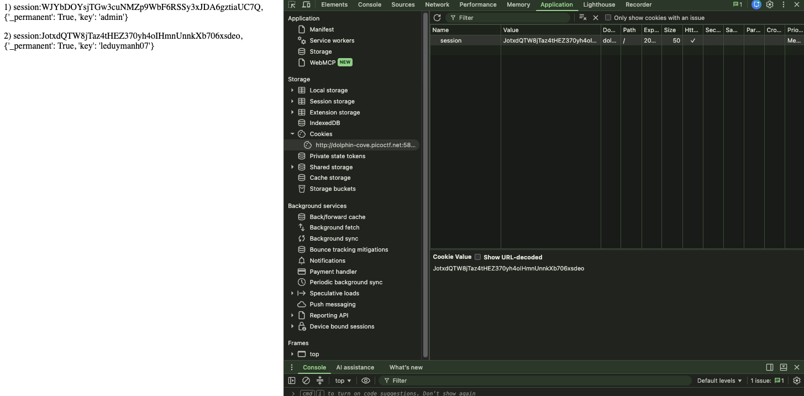

# [Old Sessions] - PicoCTF [2026]

**Category:** Web Exploitation
**Difficulty:** Easy

---

## Description

Proper session timeout controls are critical for securing user accounts. If a user logs in on a public or shared computer but doesn’t explicitly log out (instead simply closing the browser tab), and session expiration dates are misconfigured, the session may remain active indefinitely.

This then allows an attacker using the same browser later to access the user’s account without needing credentials, exploiting the fact that sessions never expire and remain authenticated.

Your friend tells you to check out a new social media platform he built a few years ago. Although its still under development, he said the site is almost complete. He also mentioned that he hates constantly logging into sites, and so has made his page that 'once you login, you never have to log-out again'!

Browse [here](http://dolphin-cove.picoctf.net:58302/login) and find the flag!

---

## Analysis

First, I create an account and login. The interface easily give me the hint, you can see at the second comment `Hey I found a strange page at /sessions`

Next, I go to the `/sessions` page: 

The description almost gave me the hint that the flag is in the admin interface, so I needed to find a way to get in. The sessions page also gave me a list of session IDs, so I just swapped mine with the admin's in the Cookies tab under the Application panel and refreshed the page to find the flag.

---

## Solutions

---

## Flag

---

## Takeaways

- **Session IDs are the key to authentication** — once a user logs in, the server issues a session ID stored in a cookie. As long as that session ID is valid, the server trusts whoever holds it, no password needed
- **Never expose session IDs** to other users (e.g., listing all active sessions on a `/sessions` page) — an attacker can simply steal one and impersonate that user
- **Sessions must have an expiration date** — a session that never expires stays exploitable forever, even years after the original user last logged in
- **Browser DevTools → Application → Cookies** is the go-to place to inspect and manipulate session cookies; swapping a session ID there is enough to hijack another user's account
- **Session fixation / session hijacking** is a real-world vulnerability covered by OWASP — always validate, rotate, and expire session tokens properly
