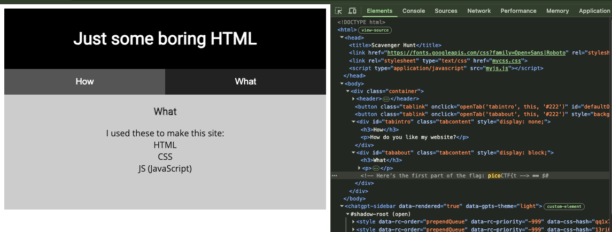
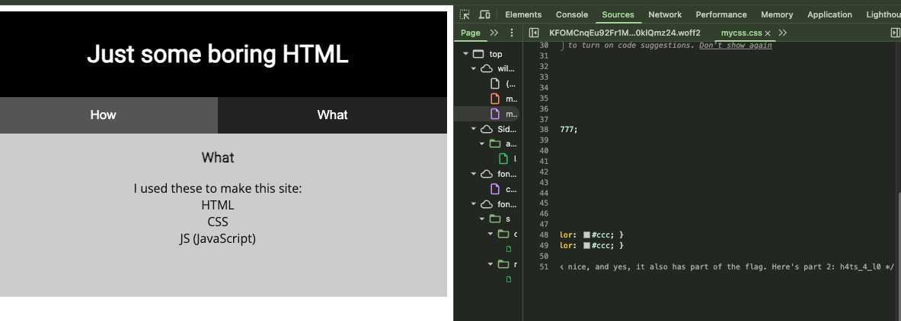
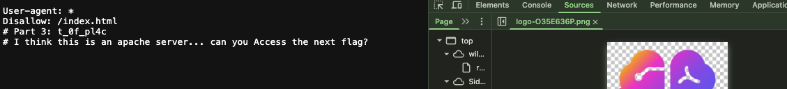
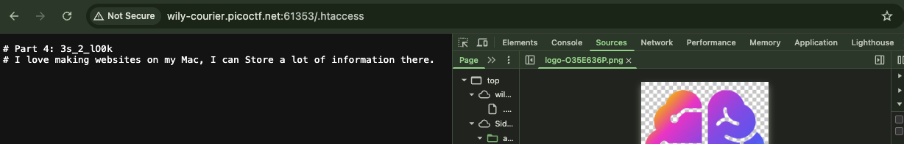
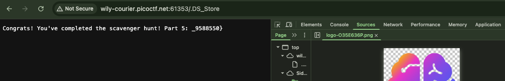

# [Scavenger Hunt] - PicoCTF [2021]

**Category:** Web Exploitation  
**Difficulty:** Easy

---

## Description

There is some interesting information hidden around this site. Can you find it?

http://wily-courier.picoctf.net:59832/

---

## Analysis

The page is a simple static site built with HTML, CSS, and JavaScript — no forms, cookies, or dynamic elements. The challenge name hints that the flag is fragmented and hidden across multiple locations.

The source files (HTML, CSS, JS) are the obvious first targets. Beyond those, web servers often expose hidden metadata files — `robots.txt`, `.DS_Store`, and `.htaccess` — that developers accidentally leave accessible. Given the challenge context, the flag is likely split across all of these.

---

## Solution

### Step-by-Step

**Step 1 — Inspect the HTML Source**

Open the page in a browser and view the page source (`Ctrl+U` or right-click → *View Page Source*). Inside the HTML, embedded within a comment, the **first fragment** of the flag is found:

```html
<!-- picoCTF{t-->
```


**Step 2 — Inspect the CSS File**

The HTML source references an external stylesheet (e.g., `mycss.css`). Open it directly in the browser. Inside the CSS file, hidden in a comment, the **second fragment** appears:

```css
/* h4ts_4_l0t_  */
```


**Step 3 — Inspect the JavaScript File**

Similarly, the HTML references an external JS file (e.g., `myjs.js`). Open it directly. But I don't find anything reference to the flag. 

**Step 4 — Check `robots.txt`**

Navigate to:
```
http://wily-courier.picoctf.net:59832/robots.txt
```

The file contains the **third fragment**:

```
t_0f_pl4c
```



It also hints at the existence of an Apache server configuration file.

**Step 5 — Check `.htaccess`**

Navigate to:
```
http://wily-courier.picoctf.net:59832/.htaccess
```

The `.htaccess` file contains the **fourth fragment** and hints that a macOS metadata file may also be present:

```
3s_2_lO0k
```


**Step 6 — Check `.DS_Store`**

Navigate to:
```
http://wily-courier.picoctf.net:59832/.DS_Store
```

The `.DS_Store` file contains the **final fragment** and the closing brace:

```
_9588550}
```


**Assembling the Flag**

Concatenating all fragments in order:

| Source | Fragment |
|--------|----------|
| HTML comment | `picoCTF{t` |
| CSS comment | `h4ts_4_l0` |
| JS file | *(no fragment — hint only)* |
| `robots.txt` | `t_0f_pl4c` |
| `.htaccess` | `3s_2_lO0k` |
| `.DS_Store` | `_9588550}` |

---

## Flag

```
picoCTF{th4ts_4_l0t_0f_pl4c3s_2_lO0k_9588550}
```

---

## Takeaways

- **`robots.txt`** is a plain-text file placed at the web root that instructs search engine crawlers (like Googlebot) which paths they are allowed or disallowed to index. While it is not a security mechanism, it often inadvertently reveals the existence of sensitive directories and files that the developer wanted to hide from search results — making it a valuable first stop during web reconnaissance.

- **`.DS_Store`** is a hidden metadata file automatically created by macOS Finder in every directory a user browses. When developers work on a Mac and deploy their project without a proper `.gitignore` or server-side block, these files get uploaded to the web server. They contain directory structure information, which attackers can parse to enumerate files and folders that are not publicly linked.

- **`.htaccess`** is a directory-level configuration file used by Apache web servers. It can control redirects, authentication, URL rewriting, and access rules. If left readable and unprotected, it can leak server configuration details, reveal protected paths, or even expose embedded developer notes — as demonstrated in this challenge.

- **Thorough enumeration matters** — in web challenges (and real penetration tests), flags and sensitive data are rarely found in one place. Checking standard hidden files (`robots.txt`, `.DS_Store`, `.htaccess`, `.git/`, `sitemap.xml`, etc.) as a routine step during reconnaissance can uncover information that is completely invisible through normal browsing.
