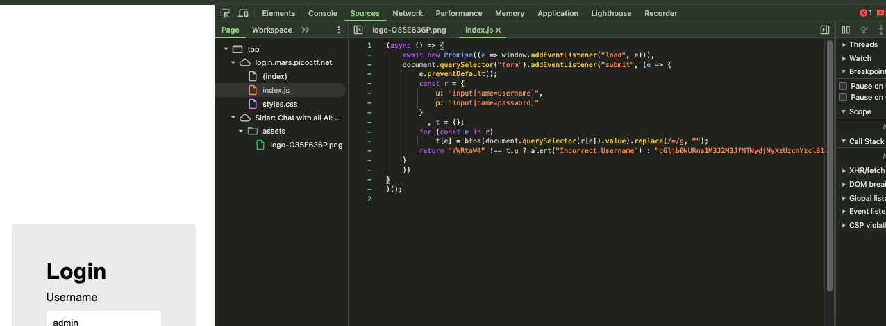

# [login] - PicoCTF [2022]

**Category:** Web Exploitation  
**Difficulty:** Medium

---

## Description

My dog-sitter's brother made this website but I can't get in; can you help?

---

## Analysis

After reading the challenge description, I jumped straight into inspecting the page using the browser's **DevTools** (F12):

- **Elements tab**: Reviewed the HTML structure of the login page, looking for hidden fields, comments, or hardcoded values.
- **Sources tab**: Browsed through the source files loaded by the client.

Inside **Sources**, I found a `.js` (JavaScript) file containing the client-side login logic. While reading through the code, I noticed that the `password` check contained a suspicious string — a long sequence of alphanumeric characters ending with `=`. This is a telltale sign of **Base64 encoding**, something I had already encountered in previous challenges.




---

## Solution

Suspecting the password string in the JS file was Base64-encoded, I copied it and attempted to decode it directly in the browser via the DevTools Console:

```js
atob("cGljb0NURns1M3J2M3JfNTNydjNyXzUzcnYzcl81M3J2M3JfNTNydjNyfQ")
```

The decoded output was the flag.

---

## Flag

```
picoCTF{53rv3r_53rv3r_53rv3r_53rv3r_53rv3r}
```

---

## Takeaways

